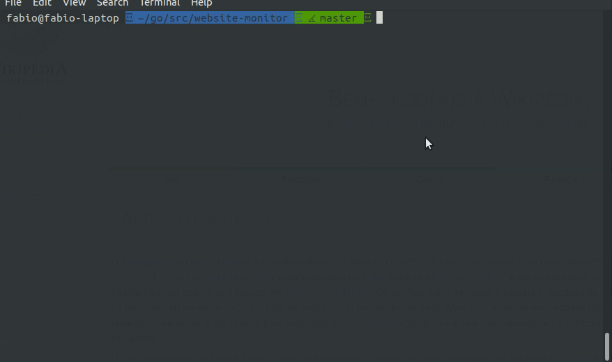

# Go Monitor

This CLI project monitors the health check of your applications and generates logs with information about your applications is running or not.

## How it works



## How to use

1 - Clone the project in your `src` dir.
```sh
git clone git@github.com:fbsouzas/go-monitor.git
```

2 - Go to the project dir.
```sh
cd go-monitor
```

3 - Create the file with the applications to monitor.
```sh
cp applications.txt.sample applications.txt
```

4 - Put your applications in the `applications.txt` file. Example:
```sh
https://www.my-aplication-1.com/
https://www.my-application2.com/
```
5 - Open the `main.go` and configure with your preferences.
```go
# main.go
const numberTimesToTest = 3 # Number of times that applications will be test
const delay = 5 # Delay of each test
const applicationsFile = "applications.txt" # Filename with the applications
const logFile = "log.txt" # Log filename
```

6 - Run the **Go monitor**
```sh
go run main.go
```

## Goal

This project was created for studying and have the first contact with Golang and learn more about this programming language.

